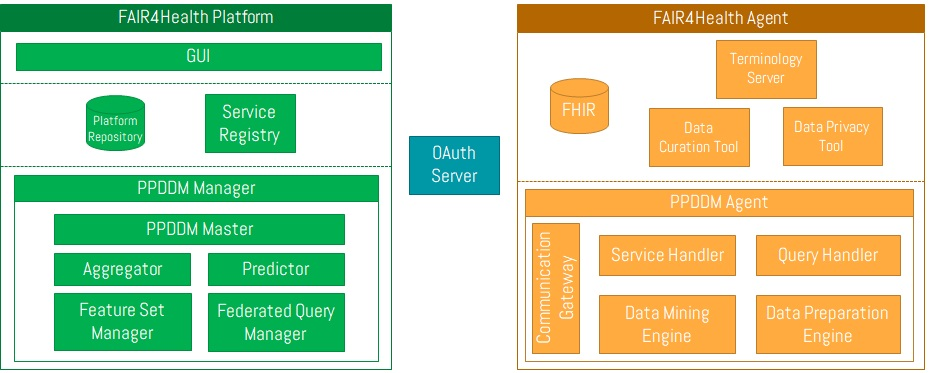

# f4h-deployment

# Context


Finally https is provided by means of an [nginx reverse proxy]().

# Description

The repository provides the docker compose scripts to provide the FAIR4Health platformm ready for production. It provides https through nginx as reverse proxy and authentication by means of KeyCloak IdM and Proxy.
The software is prepared for production with the following architecture (letsencrypt for https):

<p align="center">
	
</p>

Nginx is used as reverse proxy. For testing, port 80 and simple names are used: f4h-portal, f4h-backend, keycloak, discovery, ppddm-manager. For production the port must be changed to 443, and letsencrypt must be used to provide the https certs. You should change the suitable domains and configuration details in the .env file and uncomment docker-compose.yml code before deploying the containers.

# Technologies and tools

- Docker compose
- KeyCloak IdM
- MariaDB
- Nginx as reverse proxy and letsencrypt

# How to deploy

[Install Docker CE](https://docs.docker.com/install/). For Windows and Mac a [docker toolbox desktop is available](https://docs.docker.com/toolbox/overview/). Remember that Docker toolbox is published at 192.168.100.99 (`user: docker, password: tcuser`)

**Tip**: To avoid performance issues, increment VirtualBox default VM memmory to 4g

Deploy using docker-compose:

```
Stop and remove the containers
docker-compose down

Launch the containers (dettached)
docker-compose up -d
```

**IDENTIFIED ERRORS**

- 

# How to use

The project comes with a [docker-compose](https://docs.docker.com/compose/) which deploys testing containers for Keycloak (port: 8080), Consul (8500), OAuth 2.0 Authenticator (8081), Gateway () and Service Discovery ():

0. Check the configuration values at the environment (`.env`) file. You can modify at your needs. [Environments](https://docs.docker.com/compose/environment-variables/) are used to configure the installation. Modify the `.env` to comply your needs.
1. Execute `docker-compose up -d`
2. Wait a couple of minutes until the stack is deployed. 
3. Access the Keycloak console `http://localhost:8080` (**user**: admin, **password**: Pa55w0rd)
      * Create a realm `FAIR4Health`
		* Inside the realm create a client_id: `fair4health-client`
		* Create a user: fair4health-test. Modify the creadentials (temporary off)
		* Inside the realm create a client_id: `consul-client` with Valid Redirect URI `http://discovery/*`
		* Create a user: fair4health-discover. Modify the creadentials (temporary off)
4. Access the authenticator `http://localhost:8081/swagger-ui.html`
      * Open Login operation under Auth controller, `Try it out`:
      * In the JSON include the user created in Keycloak (`test`)
      * The response is a OAuth access token
5. Access the portal ``
```

The nginx reverse proxy allows also accessing using domains: discovery and keycloak (if you redirect the domains to localhost or the IP where you are deploying the containers).

**Tip**: if you are using Docker toolbox point the domains to IP 192.168.99.100.

```
192.168.99.100 keycloak
192.168.99.100 discovery
```

# How to contribute

Features and bug fixes are more than welcome. They must be linked to an issue, so the first step before contributing is the creation of a [GitHub issue](https://github.com/fair4health/f4h-deployment/issues).

# External resources

- 

# License

Apache 2.0.

